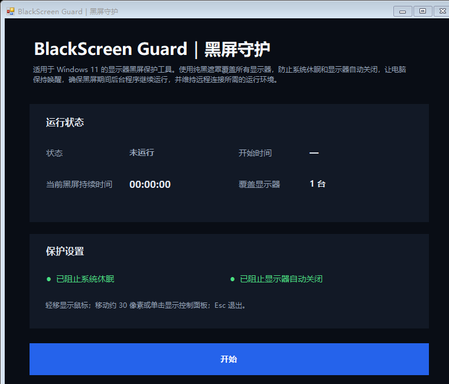
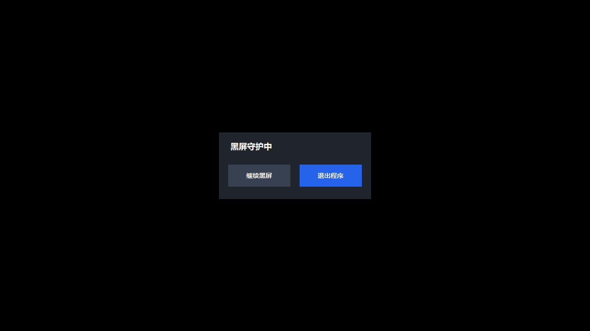

<p align="center">
  
</p>

<h1 align="center">BlackScreen Guard｜黑屏守护</h1>

<p align="center">
  <a href="README_EN.md">English</a> | 简体中文
</p>

适用于 Windows 11 的多显示器黑屏保护工具。使用纯黑遮罩覆盖所有显示器，防止系统休眠和显示器自动关闭，让电脑保持唤醒，确保黑屏期间后台程序继续运行，并维持远程连接所需的运行环境。

## 界面预览

### 控制主页

<p align="center">
  
</p>

### 黑屏控制面板

点击“开始”后，程序首先以纯黑画面覆盖所有显示器。

<p align="center">
  
</p>

黑屏后移动鼠标约 30 像素或单击，即可显示“继续黑屏”和“退出程序”控制面板。

<p align="center">
  
</p>

## 功能

- 使用纯黑窗口覆盖所有已连接的显示器
- 阻止因系统闲置而自动休眠或关闭显示器
- 黑屏期间继续运行后台程序和现有网络会话
- 拦截黑屏窗口内的普通按键与鼠标点击，减少误操作
- 鼠标静止约 1.2 秒后自动隐藏，移动时立即显示
- 移动约 30 像素或单击后显示控制面板
- 控制面板无操作 4 秒后自动隐藏
- 支持“继续黑屏”、退出程序和 `Esc` 快速退出
- 保留 Windows `Ctrl + Alt + Delete` 安全序列

## EXE 下载与使用

从 [Releases](https://github.com/celestial-micha/BlackScreenGuard/releases) 下载最新的 `BlackScreenGuard.exe`，双击运行，然后在控制页面点击“开始”。

程序无需安装。首次运行未经代码签名的 EXE 时，Windows SmartScreen 可能显示安全提示。

## 从源码运行

双击 `启动 BlackScreen Guard.cmd`。Windows 11 自带运行所需的 Windows PowerShell 和 WinForms。

## 构建 EXE

在 Windows 11 中双击 `build-exe.cmd`，构建结果位于：

```text
dist\BlackScreenGuard.exe
```

构建过程使用 Windows 自带的 IExpress。嵌入自定义图标需要 Node.js，并在首次构建前运行：

```powershell
pnpm install
```

## 工作方式与限制

- 黑屏由置顶的纯黑窗口实现，并不真正关闭显示器。LCD 显示器的背光通常仍然开启。
- 程序使用 Windows `SetThreadExecutionState` 请求阻止闲置休眠和显示器自动关闭。
- 公司域策略、安全软件、断网、关机、重启或断电仍可能影响后台程序和远程连接。
- `Ctrl + Alt + Delete` 属于 Windows 安全序列，普通应用无法也不应拦截。

## 项目文件

```text
BlackScreenGuard.ps1          主程序
启动 BlackScreen Guard.cmd    源码启动入口
build-exe.cmd                 EXE 构建入口
package.sed                   IExpress 打包配置
assets/                       图标资源
assets/screenshots/           README 界面截图
BlackScreenGuard-logo.png     高清 Logo
BlackScreenGuard.ico          程序窗口图标
LICENSE                       MIT 开源许可证
```

## 开源许可证

本项目采用 [MIT License](LICENSE) 开源。

你可以自由使用、复制、修改和分发本项目；使用或分发时请保留原始版权与许可证声明，并注明项目来源：

[celestial-micha/BlackScreenGuard](https://github.com/celestial-micha/BlackScreenGuard)
